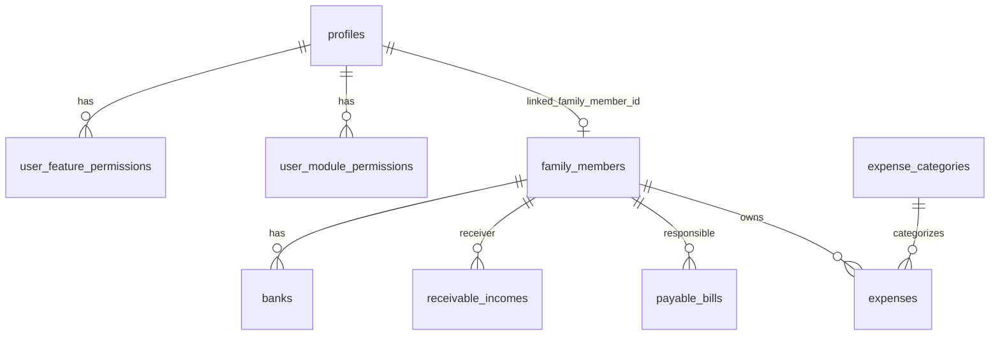

# FamilyFinance - Arquitetura Tecnica

Este documento descreve a arquitetura tecnica atual do FamilyFinance e mostra como browser/PWA, Next.js SSR, Server Actions, sistema de permissoes, Supabase Auth, Supabase RLS e banco PostgreSQL trabalham juntos.

Ele complementa, sem substituir:

- `docs/PRODUCT_VISION.md` - visao de produto;
- `docs/PERMISSION_AND_DASHBOARD_STRATEGY.md` - estrategia conceitual de permissoes e dashboard;
- `docs/ADMIN_PERMISSIONS.md` - regras de Admin familiar;
- `docs/ACCESS_CHANNELS.md` - divisao entre app/PWA e Web Admin;
- `docs/MOBILE_STRATEGY.md` - futuro app React Native/Expo;
- `docs/VALIDACAO_TECNICA.md` - validacao operacional;
- `docs/pm/*` - documentos de gestao do projeto.

## Objetivo da arquitetura

A arquitetura do FamilyFinance precisa garantir quatro coisas:

1. cada usuario autenticado acessa apenas o que foi autorizado;
2. o Admin familiar consegue administrar a familia inteira;
3. as regras de permissao existem no servidor, nao apenas na tela;
4. o banco permanece protegido por RLS e por validacoes server-side.

A regra central do produto continua sendo:

```txt
Role define o padrao inicial.
Admin define a permissao real.
Permissao sempre vence o role.
```

## Visao em camadas

```txt
Browser / PWA
    ↓
Next.js Proxy de Sessao
    ↓
Next.js App Router
    ↓
Server Components / Client Components
    ↓
Server Actions / Server Queries
    ↓
Camada de Permissoes FamilyFinance
    ↓
Supabase Auth + Supabase Clients
    ↓
Supabase RLS
    ↓
PostgreSQL Database
```

## Diagrama principal

```mermaid
flowchart TD
    A[Browser / PWA] --> B[proxy.ts]
    B --> C[lib/supabase/proxy.ts]
    C --> D{Supabase session / claims validos?}

    D -- Nao --> E[/auth/login]
    D -- Sim --> F[Next.js App Router]

    F --> G[Public/Auth Routes]
    F --> H[Protected Routes]

    H --> I[Server Components]
    H --> J[Client Components]

    J --> K[Server Actions]

    I --> L[Finance Server Queries]
    K --> M[Finance Mutations]

    L --> N[Access Control Layer]
    M --> N

    N --> O[getCurrentProfile]
    N --> P[getVisibleModuleKeys]
    N --> Q[getAccessibleMemberIds]
    N --> R[assertCanAccessMember]
    N --> S[canUseFeature]

    O --> T[profiles]
    P --> U[user_module_permissions]
    Q --> U
    Q --> V[family_members]
    S --> W[user_feature_permissions]

    L --> X[Supabase Server Client]
    M --> X
    N --> Y[Supabase Admin Client server-side]

    X --> Z[Supabase RLS]
    Z --> DB[(PostgreSQL DB)]

    Y --> DB

    DB --> AA[Dados filtrados / mutacoes persistidas]
    AA --> I
    AA --> K
    I --> A
```

## Fluxo de request protegida

Exemplo: usuario acessa `/protected/gastos`.

```txt
1. Browser solicita /protected/gastos
2. proxy.ts intercepta a request
3. updateSession cria Supabase server client
4. updateSession verifica claims da sessao
5. sem sessao: redirect /auth/login
6. com sessao: segue para App Router
7. App Router renderiza Server Component da pagina
8. pagina chama helpers financeiros server-side
9. helpers chamam getCurrentProfile()
10. getCurrentProfile resolve profile do usuario
11. camada de permissoes resolve modulos, acoes e escopo
12. query busca apenas membros acessiveis
13. Supabase RLS valida owner_id/auth.uid quando aplicavel
14. dados retornam para o Server Component
15. HTML/React payload renderiza no browser
```

## Fluxo de mutacao protegida

Exemplo: usuario cria um gasto.

```txt
1. Usuario preenche formulario no browser
2. Client Component submete para Server Action
3. Server Action valida dados obrigatorios
4. Server Action chama getCurrentProfile()
5. Server Action chama assertCanAccessMember('GASTOS', 'can_create', familyMemberId)
6. assertCanAccessMember calcula membros permitidos
7. se o membro nao estiver no escopo: erro de permissao
8. se permitido: insert em expenses
9. Supabase valida RLS/policies quando usando server client comum
10. dados sao persistidos
11. revalidatePath atualiza paginas afetadas
12. usuario recebe feedback na UI
```

## Responsabilidades por camada

### 1. Browser / PWA

Responsabilidades:

- exibir UI;
- armazenar cookies de sessao;
- enviar formularios;
- navegar entre paginas;
- mostrar ou ocultar componentes ja filtrados pelo servidor;
- executar interacoes client-side simples.

O browser nao deve:

- acessar `SUPABASE_SERVICE_ROLE_KEY`;
- decidir permissao sensivel sozinho;
- buscar dados financeiros sensiveis sem passar pelo servidor;
- confiar somente em esconder botoes para proteger acao.

Arquivos principais:

```txt
app/manifest.ts
app/layout.tsx
app/page.tsx
app/protected/layout.tsx
components/**
```

### 2. Next.js Proxy

Arquivos:

```txt
proxy.ts
lib/supabase/proxy.ts
```

Responsabilidades:

- interceptar requests;
- ignorar assets e rotas publicas;
- criar Supabase server client por request;
- sincronizar cookies;
- chamar `supabase.auth.getClaims()`;
- redirecionar usuario sem sessao para `/auth/login`;
- manter a sessao consistente entre browser e servidor.

Rotas publicas ignoradas pelo proxy de auth:

```txt
/auth/*
/login
/_next/*
/favicon.ico
/manifest.webmanifest
/opengraph-image.png
/twitter-image.png
arquivos estaticos com extensao
```

### 3. Next.js App Router

Responsabilidades:

- organizar rotas publicas e protegidas;
- renderizar Server Components;
- carregar Client Components quando necessario;
- conectar Server Actions aos formularios;
- usar layouts compartilhados.

Rotas publicas/autenticacao:

```txt
/
/auth/login
/auth/sign-up
/auth/sign-up-success
/auth/forgot-password
/auth/update-password
/auth/error
/auth/confirm
```

Rotas protegidas:

```txt
/protected
/protected/pessoas
/protected/gastos
/protected/contas-a-pagar
/protected/contas-a-receber
/protected/bancos
/protected/relatorios
/protected/configuracoes
/protected/admin
/protected/admin/usuarios
/protected/admin/permissoes
```

### 4. Server Components

Responsabilidades:

- carregar dados no servidor;
- chamar helpers de permissao;
- montar visao conforme perfil;
- impedir renderizacao de dados nao autorizados;
- renderizar menus dinamicos.

Exemplos:

```txt
app/protected/page.tsx
app/protected/pessoas/page.tsx
app/protected/gastos/page.tsx
app/protected/contas-a-pagar/page.tsx
app/protected/contas-a-receber/page.tsx
app/protected/bancos/page.tsx
app/protected/relatorios/page.tsx
app/protected/admin/page.tsx
app/protected/admin/usuarios/page.tsx
app/protected/admin/permissoes/page.tsx
```

### 5. Client Components

Responsabilidades:

- formularios;
- modais/dialogs;
- estados interativos;
- selecao de usuario em formularios;
- checkboxes/radios de permissoes;
- chamadas indiretas a Server Actions.

Exemplos:

```txt
components/login-form.tsx
components/sign-up-form.tsx
components/finance/expense-form.tsx
components/finance/payable-bill-form.tsx
components/finance/receivable-income-form.tsx
components/finance/bank-account-form.tsx
components/finance/family-user-form.tsx
components/finance/permissions-form.tsx
```

Regra:

```txt
Client Component pode ajudar na experiencia, mas nunca deve ser a fonte final da permissao.
```

### 6. Server Actions

Responsabilidades:

- validar entrada do formulario;
- identificar usuario/perfil;
- validar permissao;
- executar insert/update/delete;
- revalidar paginas afetadas;
- retornar erro ou sucesso.

Arquivos:

```txt
app/auth/sign-up/actions.ts
app/protected/pessoas/actions.ts
app/protected/gastos/actions.ts
app/protected/contas-a-pagar/actions.ts
app/protected/contas-a-receber/actions.ts
app/protected/bancos/actions.ts
app/protected/configuracoes/actions.ts
app/protected/admin/actions.ts
```

## Camada de permissoes

A camada de permissoes fica principalmente em:

```txt
lib/finance/access-control.ts
lib/finance/permissions.ts
lib/finance/admin-server.ts
lib/finance/profile-linking.ts
```

### Entidades de permissao

```txt
profiles
user_module_permissions
user_feature_permissions
family_members
```

### Funcoes principais

```txt
getCurrentProfile()
getModulePermission(profileId, module)
getFeaturePermission(profileId, featureKey)
canUseFeature(featureKey)
canViewModule(module)
getVisibleModuleKeys(modules)
getAccessibleMemberIds(module, action)
assertCanAccessMember(module, action, targetMemberId)
```

### Como `getCurrentProfile()` funciona

```txt
1. Le claims do usuario autenticado.
2. Procura profile por auth_user_id.
3. Se nao encontrar, procura profile autorizado por e-mail.
4. Se o profile por e-mail existir e estiver ativo, tenta vincular auth_user_id.
5. Se nao houver profile e o e-mail nao for ADMIN_EMAIL, bloqueia.
6. Se o e-mail for ADMIN_EMAIL, cria/garante perfil Admin.
```

### Como `getAccessibleMemberIds()` funciona

```txt
1. Carrega o profile atual.
2. Se profile estiver inativo, retorna vazio.
3. Se role for admin, retorna todos os membros ativos da familia.
4. Busca permissao do modulo.
5. Se nao houver permissao ou a acao estiver false, retorna vazio.
6. Se scope = family, retorna todos os membros ativos.
7. Se scope = selected, retorna allowed_member_ids.
8. Se scope = own, retorna linked_family_member_id.
```

### Como as telas usam permissoes

- `app/protected/layout.tsx` usa `getVisibleModuleKeys()` para montar menus desktop/mobile.
- Dashboard usa permissoes para decidir blocos visiveis.
- Queries financeiras usam `getAccessibleMemberIds()` para filtrar por pessoa.
- Server Actions usam `assertCanAccessMember()` antes de criar, editar ou excluir.
- Admin usa `requireAdminProfile()`/`ensureAdminProfile()` para proteger rotas administrativas.

## Supabase Clients

### Browser client

Arquivo:

```txt
lib/supabase/client.ts
```

Uso:

- browser;
- operacoes publicas de auth quando aplicavel;
- sem service role.

### Server client

Arquivo:

```txt
lib/supabase/server.ts
```

Uso:

- Server Components;
- Server Actions;
- leitura/escrita associada a sessao;
- respeita cookies e RLS.

### Admin client

Arquivo:

```txt
lib/supabase/admin.ts
```

Uso:

- apenas server-side;
- operacoes administrativas;
- service role;
- resolver permissoes quando RLS da sessao comum nao basta;
- vincular profiles;
- consultar Auth Admin API.

Regra critica:

```txt
createAdminClient() nunca deve ser importado em Client Component.
SUPABASE_SERVICE_ROLE_KEY nunca deve aparecer no browser.
```

## RLS e permissoes do app

O FamilyFinance usa duas camadas de seguranca que se complementam:

```txt
1. RLS do Supabase
2. Permissoes da aplicacao
```

### RLS

RLS protege o banco por `owner_id = auth.uid()` nas tabelas financeiras base.

Isso impede acesso direto indevido quando o usuario usa o client comum associado a propria sessao.

### Permissoes da aplicacao

As permissoes da aplicacao definem a regra familiar mais fina:

- qual modulo aparece;
- qual acao pode executar;
- quais membros financeiros pode acessar;
- se pode ver proprio, selecionados ou familia inteira;
- funcionalidades especificas liberadas.

### Por que as duas camadas existem

RLS protege o banco em nivel baixo.

A camada de permissoes protege a regra de negocio familiar.

As duas devem trabalhar juntas. Nunca confiar apenas no frontend.

## Banco de dados

### Tabelas financeiras

```txt
family_members
expense_categories
expenses
payable_bills
receivable_incomes
banks
```

### Tabelas de acesso

```txt
profiles
user_module_permissions
user_feature_permissions
```

### Relacionamento conceitual



## Autenticacao e vinculo familiar

### Cadastro nao e livre

O usuario familiar so deve criar acesso se o Admin ja autorizou seu e-mail em `profiles`.

Fluxo:

```txt
Admin cria profile com e-mail
    ↓
Usuario acessa /auth/sign-up
    ↓
checkAuthorizedFamilyEmail(email)
    ↓
se autorizado, Supabase cria/valida usuario Auth
    ↓
/auth/confirm valida token_hash
    ↓
linkAuthUserToFamilyProfile vincula auth_user_id ao profile
```

Arquivos:

```txt
app/auth/sign-up/actions.ts
app/auth/confirm/route.ts
lib/finance/profile-linking.ts
lib/finance/access-control.ts
```

## Dashboard e relatorios

### Dashboard

Arquivo:

```txt
app/protected/page.tsx
```

Dados:

```txt
getExpenseDashboardData()
getPayableBillsDashboardData()
getReceivableIncomesDashboardData()
getBanksDashboardData()
getVisibleModuleKeys()
```

Responsabilidade:

- mostrar apenas blocos autorizados;
- consolidar dados dentro do escopo permitido;
- adaptar visao para Admin, usuario proprio ou usuario com membros selecionados.

### Relatorios

Arquivos:

```txt
app/protected/relatorios/page.tsx
lib/finance/reports-server.ts
```

Responsabilidade:

- consolidar gastos;
- consolidar contas;
- consolidar rendas;
- consolidar bancos;
- montar saldo final projetado;
- agrupar gastos por pessoa;
- agrupar gastos por categoria.

## Admin familiar

Arquivos principais:

```txt
app/protected/admin/page.tsx
app/protected/admin/actions.ts
app/protected/admin/usuarios/page.tsx
app/protected/admin/permissoes/page.tsx
lib/finance/admin-server.ts
components/finance/family-user-form.tsx
components/finance/permissions-form.tsx
```

Responsabilidades:

- garantir acesso apenas ao Admin;
- criar usuarios familiares;
- vincular usuario a membro financeiro;
- ativar/desativar usuarios;
- sincronizar usuario Auth existente pelo e-mail;
- salvar permissoes por modulo;
- salvar permissoes por acao;
- salvar escopo;
- salvar membros liberados.

## Fluxo de permissao por exemplo

### Exemplo 1: usuario comum cria gasto proprio

```txt
profile.role = user
module = GASTOS
can_create = true
scope = own
linked_family_member_id = member-pai
form.family_member_id = member-pai
resultado = permitido
```

### Exemplo 2: usuario comum tenta criar gasto para outra pessoa

```txt
profile.role = user
module = GASTOS
can_create = true
scope = own
linked_family_member_id = member-pai
form.family_member_id = member-mae
resultado = bloqueado por assertCanAccessMember
```

### Exemplo 3: Mae com escopo selected ve filhos

```txt
profile.role = user
module = GASTOS
can_view = true
scope = selected
allowed_member_ids = [member-gabryel, member-caleb]
resultado = query retorna apenas gastos desses membros
```

### Exemplo 4: Admin ve tudo

```txt
profile.role = admin
resultado = getAccessibleMemberIds retorna todos os membros ativos
```

## Componentizacao

### Componentes de app

```txt
components/app/app-card.tsx
components/app/app-data-table.tsx
components/app/app-empty-state.tsx
components/app/app-form-dialog.tsx
components/app/app-hero-card.tsx
components/app/app-page-header.tsx
components/app/app-skeleton.tsx
components/app/app-stat-card.tsx
```

### Componentes financeiros

```txt
components/finance/bank-account-form.tsx
components/finance/category-summary.tsx
components/finance/expense-category-form.tsx
components/finance/expense-form.tsx
components/finance/family-member-form.tsx
components/finance/family-user-form.tsx
components/finance/module-placeholder.tsx
components/finance/payable-bill-form.tsx
components/finance/permissions-form.tsx
components/finance/person-balance-card.tsx
components/finance/receivable-income-form.tsx
components/finance/stat-card.tsx
components/finance/upcoming-bills.tsx
```

### Componentes UI base

```txt
components/ui/badge.tsx
components/ui/button.tsx
components/ui/card.tsx
components/ui/checkbox.tsx
components/ui/dialog.tsx
components/ui/dropdown-menu.tsx
components/ui/input.tsx
components/ui/label.tsx
```

## Testes e qualidade

### Unitarios

```txt
__tests__/unit/access-control.test.ts
__tests__/unit/calculations.test.ts
__tests__/unit/mock-data.test.ts
```

Cobrem:

- calculos financeiros;
- formatacao de moeda;
- RBAC;
- escopos;
- permissoes por acao;
- admin bypass;
- perfil inativo;
- feature permissions.

### Integracao

```txt
__tests__/integration/dashboard-queries.test.ts
__tests__/integration/permissions-flow.test.ts
```

Cobrem:

- chamadas simuladas ao Supabase via MSW;
- carregamento dos grupos do Dashboard;
- falha controlada de query;
- fluxo de permissoes por escopo;
- Admin vendo todos os dados.

### Fixtures

```txt
__tests__/fixtures/mock-data.ts
__tests__/fixtures/msw-finance-data.ts
__tests__/fixtures/msw-handlers.ts
```

## Dados mockados vs dados reais

O projeto possui dados mockados historicos e dados reais no Supabase.

### Dados reais

Principalmente:

```txt
lib/finance/server.ts
lib/finance/banks-server.ts
lib/finance/reports-server.ts
lib/finance/admin-server.ts
```

### Dados mockados/testes

Principalmente:

```txt
__tests__/fixtures/mock-data.ts
__tests__/fixtures/msw-finance-data.ts
__tests__/fixtures/msw-handlers.ts
lib/finance/calculations.ts
```

Observacao tecnica:

`lib/finance/calculations.ts` ainda contem funcoes puras uteis e funcoes baseadas em fixtures. A recomendacao e separar isso futuramente para evitar confusao entre mock e producao.

## Decisoes arquiteturais atuais

### 1. Projeto personalizado, nao SaaS

Nao ha multi-tenant comercial nesta fase. O modelo atual atende uma familia especifica.

### 2. Web/PWA primeiro

A web atual valida regras, permissoes, UI e fluxo financeiro antes do app nativo.

### 3. App nativo depois

React Native + Expo estao planejados, mas nao existem neste repositorio ainda.

### 4. Admin pela web

A administracao nasce na web. O app mobile futuro deve abrir ou apontar para Admin web quando o usuario tiver permissao.

### 5. Permissao no servidor

UI pode esconder, mas servidor deve bloquear.

### 6. Service role com cuidado

Service role e permitido apenas em codigo server-side para operacoes administrativas.

## Pontos de atencao

### 1. README e docs estrategicos podem ficar atrasados

Quando o codigo evolui, documentos como estrategia e PM devem ser atualizados para nao listar como planejado algo que ja foi implementado.

### 2. RLS ainda e mais generico que a permissao fina

As policies base usam `owner_id`. A permissao fina por membro e feita na camada server-side do app. Isso deve ser mantido com cuidado e reforcado conforme o modelo amadurecer.

### 3. Mutacoes devem validar permissao sempre

Toda action nova deve seguir o padrao:

```txt
validar input
getCurrentProfile
assertCanAccessMember ou requireAdminProfile
mutar banco
revalidatePath
```

### 4. Client Components nao podem importar Admin Client

Qualquer import de `createAdminClient()` fora de contexto server-side deve ser tratado como falha critica.

### 5. Periodo financeiro ainda precisa evoluir

Dashboard e relatorios ainda precisam de periodo dinamico, filtros e comparativos.

## Checklist para nova funcionalidade

Antes de implementar novo modulo ou nova acao, responder:

```txt
1. Qual modulo controla essa tela?
2. A tela exige can_view?
3. O botao exige can_create, can_edit ou can_delete?
4. A action valida permissao no servidor?
5. A query filtra por getAccessibleMemberIds?
6. O Admin deve ter bypass?
7. Usuario inativo fica bloqueado?
8. O dado pertence ao owner_id correto?
9. A rota precisa aparecer no menu?
10. Precisa de teste unitario ou integracao?
11. Precisa atualizar README/docs?
```

## Roadmap arquitetural

### Curto prazo

- rodar lint/build/test;
- separar mock de producao em `calculations.ts`;
- completar edicoes de CRUD;
- melhorar feedback de erros silenciosos;
- tornar periodo dinamico;
- atualizar docs desatualizados de PM/estrategia.

### Medio prazo

- implementar UI completa para `user_feature_permissions`;
- aplicar `canUseFeature()` em pontos sensiveis;
- criar Contas Fixas;
- criar Alertas;
- criar filtros de relatorio;
- criar exportacao.

### Longo prazo

- preparar monorepo ou estrategia compartilhada para React Native/Expo;
- criar app mobile;
- integrar notificacoes;
- criar investimentos;
- criar acoes/cotacoes/graficos;
- reforcar RLS com funcoes/policies mais especificas se necessario.

## Regra final

```txt
Toda informacao financeira deve passar por autenticacao.
Toda tela protegida deve respeitar permissao.
Toda mutacao deve validar permissao no servidor.
Todo dado retornado deve respeitar owner_id e escopo.
Admin pode tudo, mas somente dentro da familia.
Usuario comum ve apenas o que foi liberado.
```